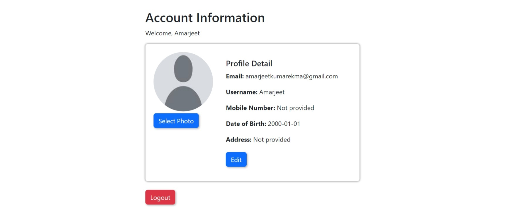
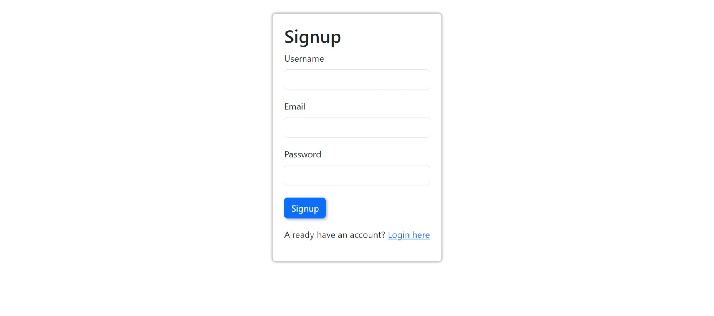
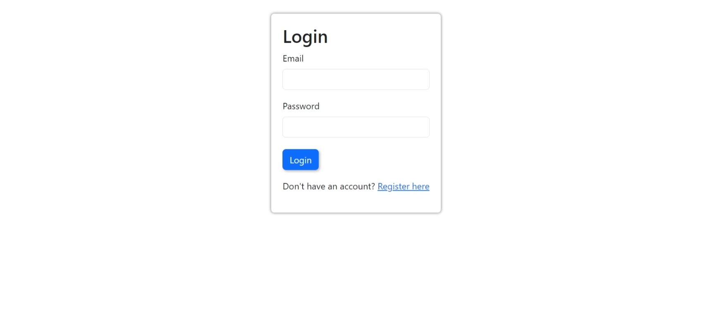

# User Profile React Application

Welcome to the User Profile React Application! This project facilitates the creation and management of user accounts. It includes a login page, a registration page, and a page for users to view and edit their account information. Bootstrap has been integrated for basic styling.

## Getting Started

Before running the application, ensure that you have Node.js installed on your machine. Clone the repository and run the following commands in the project directory:

```bash
npm install
npm run dev
```

This will install the necessary dependencies and start the development server.

## Package.json Details

The project is configured with the following `package.json` details:

```json
{
  "name": "user-profile",
  "private": true,
  "version": "0.0.0",
  "type": "module",
  "scripts": {
    "dev": "vite",
    "build": "vite build",
    "lint": "eslint . --ext js,jsx --report-unused-disable-directives --max-warnings 0",
    "preview": "vite preview"
  },
  "dependencies": {
    "bootstrap": "^5.3.2",
    "firebase": "^10.8.0",
    "react": "^18.2.0",
    "react-dom": "^18.2.0",
    "react-router-dom": "^6.22.0"
  },
  "devDependencies": {
    "@types/react": "^18.2.43",
    "@types/react-dom": "^18.2.17",
    "@vitejs/plugin-react": "^4.2.1",
    "eslint": "^8.55.0",
    "eslint-plugin-react": "^7.33.2",
    "eslint-plugin-react-hooks": "^4.6.0",
    "eslint-plugin-react-refresh": "^0.4.5",
    "vite": "^5.0.8"
  }
}
```

## Features

- **Three Screens:**
  - Account: Allows users to view and edit their account information.
  - Register: Facilitates user registration.
  - Login: Provides a login page for existing users.

- **Routing:**
  - Utilizes React Router for smooth navigation between different pages.

- **Protected Route:**
  - Implements a `Protected` component to secure the account information page.

- **Firebase Integration:**
  - Uses Firebase for account management.

## Screenshots





## Usage

1. Access the registration page by visiting `/register`.
2. Existing users can log in at `/login`.
3. Upon login, users are redirected to the account page at `/`.

Enjoy managing your user profile!